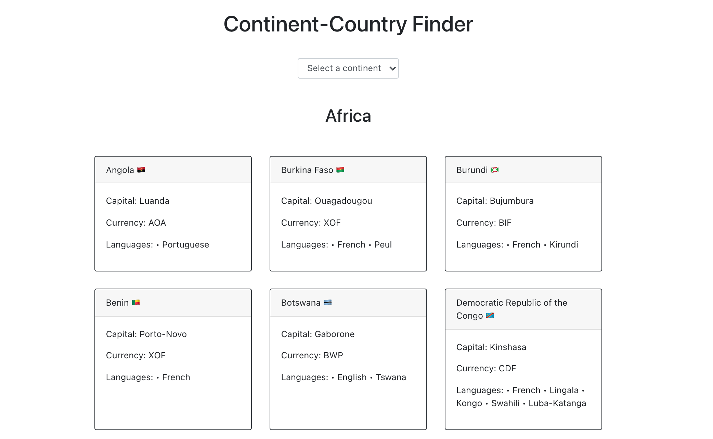

# Continent-Country Finder

This app allows you to look up a continent and see the countries on that continent. You can also find out interesting country facts, like the capital, currency, and languages spoken, along with the country flag.

It is built with HTML, CSS, JavaScript, React, Bootstrap, and GraphQL.

You can view this project here: https://nowcodethis-continent-country-finder.netlify.app/
